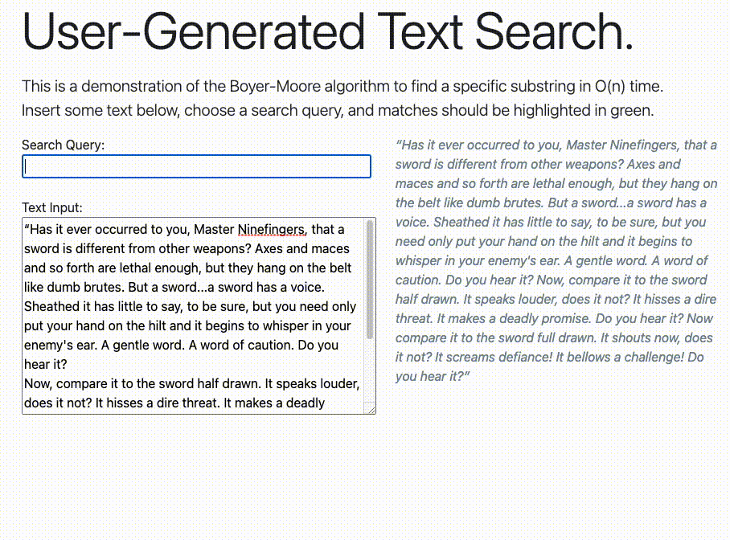

## String Searching Algorithm

Simple implementation of the Boyer-Moore algorithm to search any text for any substring. 

This is more of an effort to practice creating a simple, usable front-end which can manipulate user input in real time.

Demonstration:

